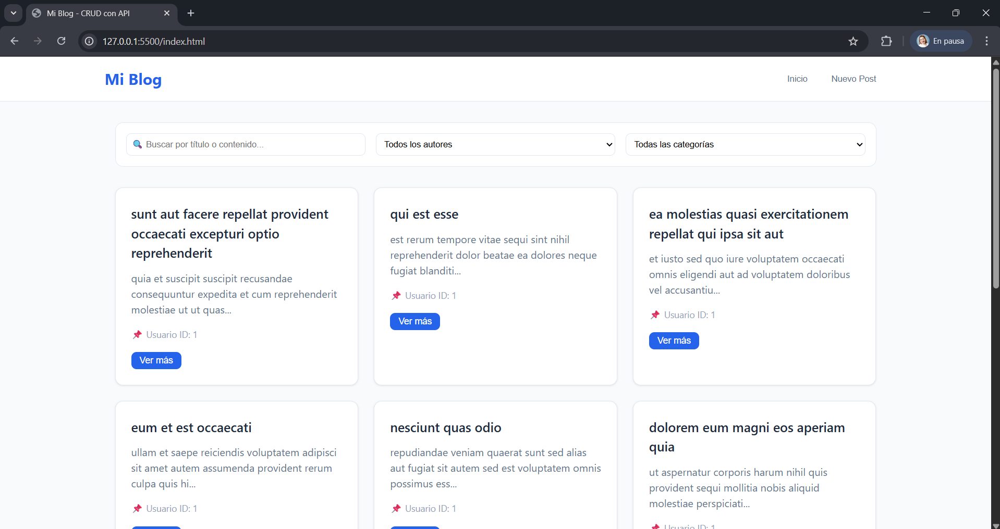

# Mi Blog - CRUD con API REST

## Integrantes
- Sebastián Lemus

## Screenshot

## Despliegue
http://127.0.0.1:5500/index.html

## Descripción
Aplicación web tipo blog que implementa CRUD completo (Create, Read, Update, Delete) sobre una API REST, usando únicamente HTML, CSS y JavaScript Vanilla.

## API utilizada
- **JSONPlaceholder** (https://jsonplaceholder.typicode.com)
- **Recurso principal:** `/posts`
- **Verbos soportados:** GET, POST, PUT, DELETE

## Funcionalidades
- Listado de publicaciones con paginación
- Vista de detalle por ID
- Crear nueva publicación
- Editar publicación existente
- Eliminar publicación (con confirmación)
- Búsqueda por título/contenido
- Filtro por autor (userId)
- Filtro por categoría (simulado)
- Feedback visual: loading, errores, éxitos
- Formularios con validación JavaScript
- Diseño responsivo

## Cómo ejecutar el proyecto
1. Clonar el repositorio
2. Abrir `index.html` en el navegador (o usar Live Server)
3. La aplicación consume la API automáticamente

## Estructura de archivos
proyecto-blog/
├── index.html
├── .gitignore
├── README.md
├── css/
│ ├── main.css
│ ├── components.css
│ └── layout.css
└── js/
├── api.js
├── ui.js
├── validation.js
├── router.js
└── main.js